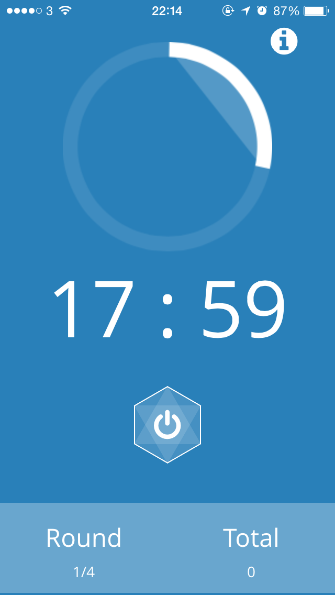
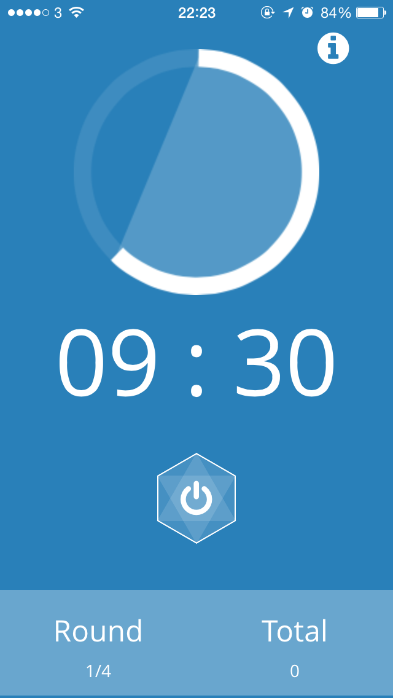
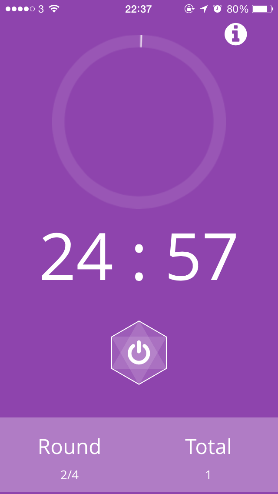

# Pomodoro
Mobile responsive application created using PhoneGap. Increases the users productivity through use of the world acclaimed Spanish Pomodoro technique.

# Why
This Spanish technique can help you power through distractions, hyper-focus, and get things done in short bursts, while taking frequent breaks to come up for air and relax.

# How to Use
Press hexagon button to start the timer,

Press again to stop timer.

Simple as that!

The Pomodoro interval is set to 25 minutes work & earns you a 5 minutes break after this is accomplished, with a 60 minute break after 4 pomodoros.